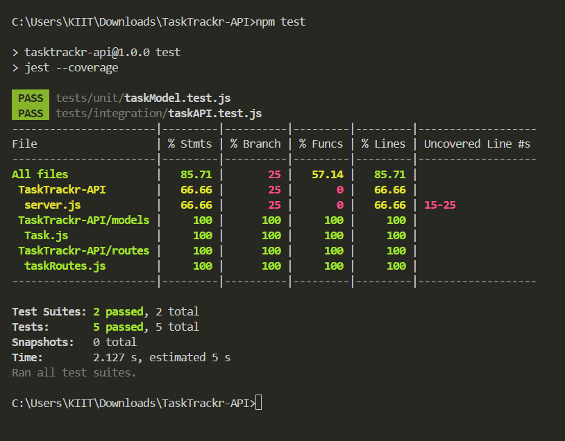

# TaskTrackr API 📝

A RESTful task management API built using Node.js, Express, and MongoDB, developed as part of the **API Fellowship – Session 2 Task 1**.

## ✨ Features

- Add, retrieve, update, and delete tasks
- MongoDB integration via Mongoose
- REST API structure
- Tested using curl

## 🚀 API Endpoints

| Method | Endpoint         | Description            | Request Body | Sample Response |
|--------|------------------|------------------------|---------------|-----------------|
| GET    | `/tasks`         | Get all tasks          | ❌           | `[{...}, {...}]` |
| POST   | `/tasks`         | Add a new task         | ✅ `{ title, description, completed? }` | `{...}` |
| PUT    | `/tasks/:id`     | Update a task          | ✅ Fields to update | `{...}` |
| DELETE | `/tasks/:id`     | Delete a task          | ❌           | `{ message }` |

## 🛠️ Tech Stack

- **Node.js** - JavaScript runtime environment
- **Express** - Web framework for Node.js
- **MongoDB** - NoSQL database
- **curl** - Command line tool for testing API endpoints

## 📦 Local Setup Instructions

1. **Clone the repository**
   ```bash
   git clone https://github.com/dhruvv028/tasktrackr-api.git
   ```

2. **Install dependencies**
   ```bash
   npm install
   ```

3. **MongoDB Setup**
   - Ensure MongoDB is running locally at `mongodb://localhost:27017/tasktrackr`

4. **Start the server**
   ```bash
   node server.js
   ```

## 🧪 Sample curl Commands

### 1️⃣ Create Task (POST)
```bash
curl -X POST http://localhost:5000/tasks -H "Content-Type: application/json" -d "{\"title\":\"Complete API Fellowship Task\",\"description\":\"Build a REST API with CRUD operations\",\"completed\":false}"
```

### 2️⃣ Get All Tasks (GET)
```bash
curl http://localhost:5000/tasks
```

### 3️⃣ Update Task (PUT)
Replace `TASK_ID` with the actual `_id` you got from a previous GET or POST.
```bash
curl -X PUT http://localhost:5000/tasks/TASK_ID -H "Content-Type: application/json" -d "{\"title\":\"Updated Task Title\",\"completed\":true}"
```

### 4️⃣ Delete Task (DELETE)
Replace `TASK_ID` as above.
```bash
curl -X DELETE http://localhost:5000/tasks/TASK_ID
```

## 📁 Project Structure

```
tasktrackr-api/
├── server.js
├── models/
│   └── Task.js
├── routes/
│   └── taskRoutes.js
├── .gitignore
└── README.md
```

## ✅ Testing Implementation

### 🧪 Running Tests

Install all dependencies:
```bash
npm install
```

Run tests with coverage:
```bash
npm test
```

### 🧰 Testing Tools Used

- **Jest** – Unit testing framework
- **Supertest** – API testing via HTTP
- **mongodb-memory-server** – In-memory MongoDB for isolated integration tests

### 📊 Test Coverage Report

Achieved over 85% test coverage across all files.

### 📸 Coverage Screenshot



## 👨‍💻 Author

**Dhruv Gupta**  
API Fellow | Aspiring Software Developer
GitHub: https://github.com/dhruvv028